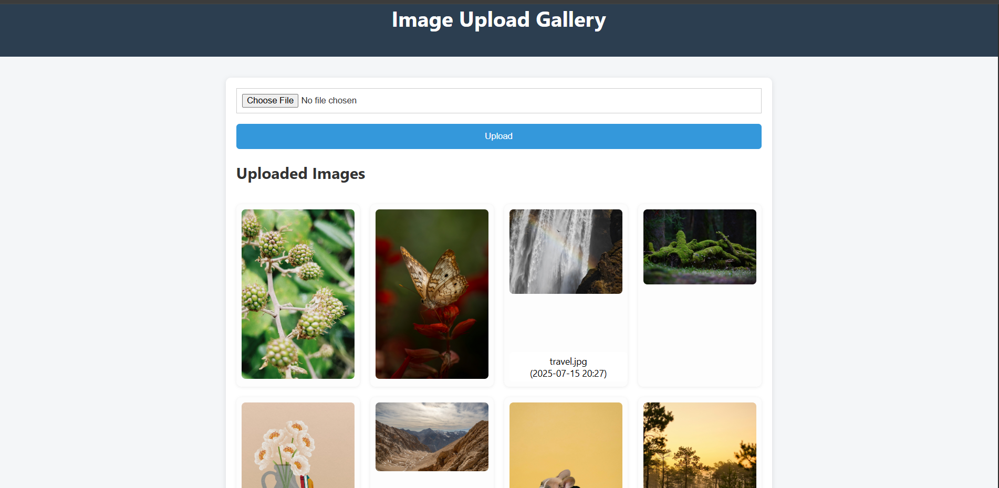

This is a simple fullstack app to upload images to AWS S3 and store metadata in PostgreSQL. It uses Flask for backend and a minimal Bootstrap frontend.

## How to Run
1. Create a `.env` file with AWS & DB credentials.
2. Run:
```
docker-compose up --build
```
3. Visit `http://localhost:5000` to upload an image.

Ensure your AWS IAM user and S3 bucket are set correctly.

## 📸 Screenshot

